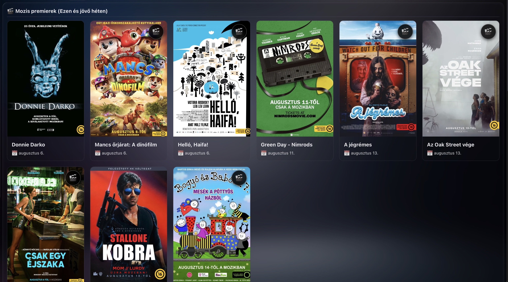
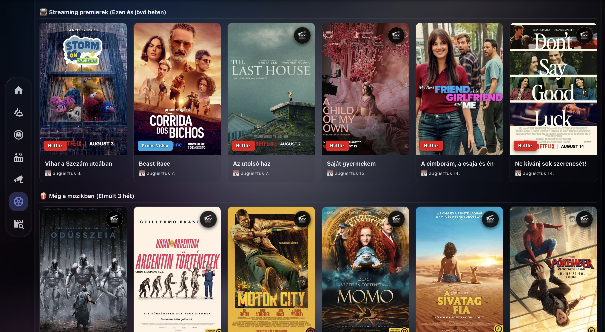
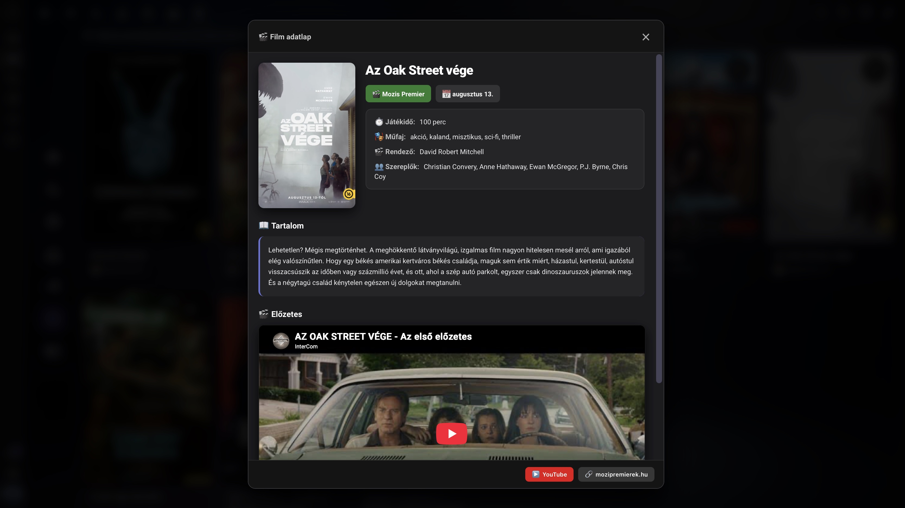

# Home Assistant mozi premierek kártya

Automatikusan lekéri a [mozipremierek.hu](https://mozipremierek.hu) mozis és
streaming premierjeit, JSON-be menti, és egy egyedi Lovelace kártyán jeleníti
meg Home Assistantban.

## Tartalom

- `scripts/mozipremierek_scraper.py` – a scraper: lekéri a főoldalt és az
  egyes filmek adatlapját (párhuzamosan), és `/config/www/mozipremierek.json`
  fájlba menti.
- `www/mozipremierek-card.js` – egyedi Lovelace kártya (`mozipremierek-card`),
  ami a fenti JSON-t jeleníti meg poszteres rácsban, kattintható részletes
  nézettel (előzetes, szereplők, szinopszis). A kártya reszponzív, tehát
  automatikusan igazodik a képernyő szélességéhez – asztali gépen több
  oszlopos rácsban, mobilon pedig egy vagy két oszlopban jelennek meg a
  poszterek.

## A kártya funkciói
 
A kártya három szekcióban jeleníti meg a premiereket – "Mozis premierek
(ezen és a jövő héten)", "Streaming premierek (ezen és a jövő héten)", és
"Még a mozikban (Elmúlt 3 hét)" –, minden filmhez
poszterrel.
 
- **🎬 Előzetes-jelző**: ha egy filmhez van elérhető YouTube-előzetes, a
  poszter jobb felső sarkában megjelenik egy kis csapó (klipbord) ikon
  – így első pillantásra látszik, melyik filmhez nézhető meg trailer.
  Ez a jelző kattintható is, ami elvisz a trailer YouTube oldalára.
- **Streaming szolgáltató badge**: a streamingre kerülő filmek
  poszterének alján egy színes badge jelzi, hogy melyik szolgáltatónál
  (Netflix, Disney+, Max, Prime Video stb.) érhető el a film – így nem
  kell rákattintani ahhoz, hogy kiderüljön, hol lehet megnézni.
- **Kattintásra bővített panel**: bármelyik poszterre kattintva (vagy
  billentyűzettel, Tab + Enter/Space-szel is elérhető) egy részletes
  nézet nyílik meg, benne:
  - a film teljes szinopszisával,
  - játékidővel, műfajjal, rendezővel és szereplőgárdával,
  - és – ha van hozzá előzetes – a **YouTube-trailer közvetlenül
    beágyazva**, lejátszóként a panelen belül, tehát nem kell külön
    lapra váltani a megnézéséhez.
  - A panel alján gyorsgombok is vannak: az előzetes megnyitása
    YouTube-on, illetve a film adatlapjának megnyitása magán a
    mozipremierek.hu oldalon.
- A kártya **reszponzív**: a fentiek asztali gépen és mobilon is
  ugyanúgy elérhetők, csak a rács oszlopainak száma igazodik a
  képernyő szélességéhez.
  
## Képernyőképek





## Telepítés

1. Másold a `scripts/mozipremierek_scraper.py` fájlt a Home Assistant
   `/config/scripts/` mappájába.
2. Másold a `www/mozipremierek-card.js` fájlt a `/config/www/` mappájába.
3. `configuration.yaml`:

   ```yaml
   shell_command:
     update_mozi_premierek: "python3 /config/scripts/mozipremierek_scraper.py"
   ```

4. `automations.yaml` – ez csak egy **példa** automatizmus, mindenki
   szabadon állíthatja be úgy, ahogy neki kényelmes. Egy dolgot viszont
   érdemes szem előtt tartani: legyünk tisztelettel a mozipremierek.hu
   üzemeltetője felé, és ne terheljük feleslegesen az oldalt sűrű
   (pl. félóránkénti) lekérésekkel – heti egy-két frissítés bőven elég,
   hiszen a premierdátumok nem változnak óránként.

   ```yaml
   - id: '1786204604864'
     alias: Mozipremierek frissítése
     description: ''
     triggers:
       - trigger: time
         at: 04:00:00
         weekday:
           - mon
           - fri
           - sun
     conditions: []
     actions:
       - action: shell_command.update_mozi_premierek
         metadata: {}
         data: {}
     mode: single
   ```

5. Add hozzá a kártyát erőforrásként. Ehhez menj az **Irányítópultok**
   menübe, majd a jobb felső sarokban lévő **három pontos menüre**
   kattintva válaszd az **Erőforrások** opciót. Itt vegyél fel egy új
   erőforrást a következő adatokkal:

   ```yaml
   url: /local/mozipremierek-card.js
   type: module
   ```

   (Ugyanez `configuration.yaml`-ben is beállítható a `lovelace:
   resources:` kulcs alatt, ha valaki YAML-módban kezeli az
   irányítópultjait.)

6. Egy irányítópulton adj hozzá egy kártyát YAML módban:

   ```yaml
   type: custom:mozipremierek-card
   ```

   Az irányítópult elrendezéséhez **Grid** vagy **Panel** típusú
   nézetet érdemes választani – a kártya ezekben jelenik meg
   legszebben, mivel így tud igazán érvényesülni a reszponzív,
   több oszlopos poszter-rács.

7. Első futtatáshoz le kell futtatni egyszer kézzel a
   `shell_command.update_mozi_premierek` szolgáltatást, hogy legyen
   JSON, mielőtt a kártya betöltődne. Ezt kétféleképpen teheted meg:
   - **Fejlesztői eszközök** (az újabb Home Assistant verziókban
     már **Eszközök** néven fut) → **Műveletek** menüpont alatt
     kiválasztod a `shell_command.update_mozi_premierek` szolgáltatást,
     és lefuttatod.
   - Vagy ha valaki nem szeretne a fejlesztői eszközökkel/szolgáltatásokkal
     bajlódni: a grafikus felületen, az **Automatizációk** között
     megnyitva a fent létrehozott automatizmust, magán az automatizáción
     belül is le lehet futtatni (jobb felső sarok, "Futtatás" gomb) –
     ez ugyanúgy meghívja a shell parancsot, csak nem kell külön
     szolgáltatás-hívással bajlódni.

## Támogasd a mozipremierek.hu-t!

Ez a projekt teljes mértékben a mozipremierek.hu nyilvánosan elérhető
adataira épül, amit az oldal üzemeltetője **teljesen ingyenesen**,
kiváló minőségben biztosít mindenki számára. Ha hasznosnak találod ezt
az integrációt, kérlek látogasd meg magát az oldalt is, és ha teheted,
támogasd az üzemeltetőt – az oldalon elérhető [Patreon](https://www.patreon.com/cw/mozipremierek/membership)
oldalon keresztül, vagy PayPal adományozási lehetőséggel, amit a weboldal alján találsz meg. Egy ilyen
szolgáltatás fenntartása munkával és költséggel jár, és megérdemli a
támogatást.

## Disclaimer

Ez a projekt egy amatőr, hobbi célú projekt, semmilyen hivatalos
kapcsolatban nem áll a mozipremierek.hu weboldallal vagy annak
üzemeltetőjével. A scraper a mozipremierek.hu nyilvánosan elérhető
HTML-jét elemzi (nincs hivatalos API), ezért ha az oldal struktúrája
megváltozik, vagy az üzemeltető bármilyen okból ellehetetleníti a
scraper használatát, a script működése egyik pillanatról a másikra
megszűnhet – ezért felelősséget nem tudok vállalni. Igyekszem
frissíteni a kódot, ha az oldal struktúrájában változás történik, de
ez nem garantált.

Fontos az is, hogy nem vagyok sem programozó, sem UI tervező – csupán
egy lelkes amatőr –, a kód és a kártya dizájnja is jelentős részben
mesterséges intelligencia (AI) segítségével készült. Ennek fényében
érdemes tekinteni mind a scraper kódját, mind a kész kártya dizájnját:
használat előtt/közben nyugodtan nézd át, és ha hibát vagy
javítanivalót találsz, szívesen veszem a visszajelzést.
